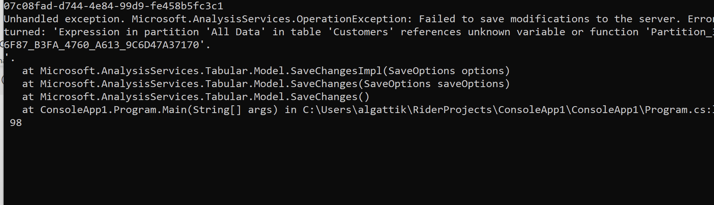

# powerbi-tom-databricks
Programming the Power BI Table Object Model to connect to Databricks tables and automate the generation of a tabular model.

This demo uses the Azure Databricks [TPC-H sample dataset](https://learn.microsoft.com/en-us/azure/databricks/dbfs/databricks-datasets). The dataset is available out of the box in Databricks.

## Prerequisites

- .Net SDK 6.0
- Power BI Desktop
- Azure Databricks with a cluster running (tested with Databricks Runtime 9.1)

## How to

Compile the program.

```
dotnet build
```

Update the  `modelgen.pbitool.json` :

- Adapt the paths into your installation path (replacing the `C:\\path\\to` strings).
- Use the paths in your Databricks cluster settings, Configuration -> Advanced options -> JDBC/ODBC (`Server Hostname` and `HTTP Path`) to update the value in the `arguments` string

Copy the file to your `C:\Program Files (x86)\Common Files\Microsoft Shared\Power BI Desktop\External Tools` directory.

Restart Power BI Desktop if it's already open.

In Power BI Desktop:

1. Click Home -> Enter Data and enter some random data, then click Load. This step serves no purpose, but is required as otherwise the next step fails with an error:

   

2. click External Tools -> Model Generator:

   

   This populates the model and relationships from [datamodel.json](datamodel.json).

   

3. When prompted for Databricks credentials, select Azure Active Directory.

4. You can now use the data in report visuals:

   

## References

- [Microsoft Learn: Programming Power BI datasets with the Tabular Object Model (TOM)](https://learn.microsoft.com/analysis-services/tom/tom-pbi-datasets)
- [Power BI Dev Camp: Programming Datasets using the Tabular Object Model](https://powerbidevcamp.powerappsportals.com/sessions/session04/)
