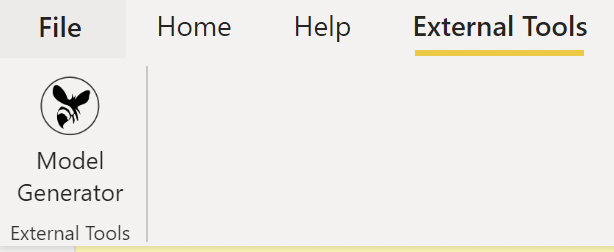

# Programming the Power BI Table Object Model to connect to Databricks
## Objective

Programming the Power BI Table Object Model to connect to Databricks tables and automate the generation of a tabular model.

## Prerequisites

- .Net SDK 6.0
- Power BI Desktop (runs only on Windows)
- Azure Databricks workspace (Premium tier is recommended as it makes connecting from Power BI Desktop easier, but not required. Premium tier trial SKU can be used)
- Azure Databricks cluster running, with Databricks Runtime 9.1 LTS (⚠️ I've had problems with Runtime version 10.x)
- For using the online service: A Power BI Pro/Premium subscription in the same tenant as the Azure Databricks subscription.

## Data

This demo uses the Azure Databricks [TPC-H sample dataset](https://learn.microsoft.com/azure/databricks/dbfs/databricks-datasets). The dataset is available out of the box in Databricks, as Delta Parquet files as well as tables in the Hive metastore (`samples` database).

The TPC-H dataset contains 8 tables related by foreign keys. The sample data contains data for the tables with up to 30M rows per table, but foreign keys are not available in Databricks.

The program uses a file [datamodel.json](GenerateDatabricksTOM/datamodel.json) in a custom format, containing the definition of the tabular model (tables, columns and relationships) and its mapping to Databricks tables and columns.

Note: In the TPC-H dataset, the relationship from `lineitem` to `partsupp` is a foreign key over two columns. As the tabular model only supports single column relationships, only the first column is used (`partkey`).

The images below compare the `partsupp` table in Databricks and Power BI:

|  |  |
| ---------------------------------------------------- | ---------------------------------------------- |

## Program

The code project (`GenerateDatabricksTOM` ) uses the [Analysis Management Objects (AMO)](https://learn.microsoft.com/en-us/analysis-services/amo/amo-concepts-and-object-model) .NET Core client library to connect to a tabular server and modify the [Tabular Object Model (TOM)](https://learn.microsoft.com/en-us/analysis-services/tom/introduction-to-the-tabular-object-model-tom-in-analysis-services-amo) definition. The same executable can be used:

- As a client to the [Power BI Online Service XML for Analysis (XMLA)  endpoint](https://learn.microsoft.com/en-gb/power-bi/enterprise/service-premium-connect-tools), modifying an online Power BI dataset.
- As a [Power BI Desktop external tool](https://learn.microsoft.com/en-us/power-bi/transform-model/desktop-external-tools-register), acting as a client to Power BI Desktop's embedded Analysis Services Tabular server.

The program reads a JSON file containing the detailed schema of the tabular data to be loaded, its columns and mapping to the Databricks tables source, and relationships to be created between tables. It connects to the Tabular server and modifies the model according the JSON file.

## Server programming with the Power BI Online Service

#### Overview

In this approach, the program modifies a Dataset in the Power BI Online Service with its the tabular object model definition.

#### Prerequisites

1. A Power BI workspace must be created with the XMLA endpoint set up for read/write.
   - ⚠️ Note that *"Connecting to a [**My Workspace**](https://learn.microsoft.com/en-us/power-bi/consumer/end-user-workspaces#types-of-workspaces) by using the XMLA endpoint is currently [not supported](https://learn.microsoft.com/en-us/power-bi/enterprise/service-premium-connect-tools#connecting-to-a-premium-workspace)"* as of the time of writing.
   - [Create a Power BI workspace](https://learn.microsoft.com/en-us/power-bi/collaborate-share/service-create-the-new-workspaces) and follow the [XMLA endpoint setup instructions](https://learn.microsoft.com/en-us/power-bi/enterprise/service-premium-connect-tools#enable-xmla-read-write) to enable the endpoint and obtain the endpoint URL (starting with `powerbi://`).
2. A dataset must be uploaded first for the program to modify, since [the XMLA endpoint does not allow creating new datasets](https://community.powerbi.com/t5/Service/Can-I-create-Dataset-using-XMLA-Endpoint/m-p/2310786/highlight/true#M150535). The XMLA endpoint also [does not allow setting data source credentials](https://learn.microsoft.com/en-us/power-bi/enterprise/service-premium-connect-tools#setting-data-source-credentials), so these must be configured manually.
   - In Power BI Desktop, [connect to your Databricks workspace](https://learn.microsoft.com/en-us/azure/databricks/partners/bi/power-bi) and connect to any table from the `samples` database. Which data is used is unimportant, since we will overwrite it with our program.
   - [Publish the report](https://learn.microsoft.com/en-us/power-bi/create-reports/desktop-upload-desktop-files) to the workspace you have configured with the XMLA endpoint. Browse the workspace in the online to confirm that a report and a dataset with the same name have been created.

#### Procedure

Run the program. In Visual Studio, use command line arguments similar to:

```
ENDPOINT DATASET ../../../datamodel.json adb-0000000000.0.azuredatabricks.net sql/protocolv1/o/00000/000-0000-000
```

Replace `ENDPOINT` with your workspace's XML endpoint (starting with `powerbi://`), and DATASET with your published dataset name. Adapt the Databricks connection strings based on your Databricks cluster settings: Configuration → Advanced options → JDBC/ODBC (`Server Hostname` and `HTTP Path`).

After the program completes successfully, connect to the dataset using either the online service or Power BI Desktop.

##### Connecting to the Dataset using the Power BI Online Service

In the online service, navigate to your Dataset. Note that the pane on the right shows the tables that have been created.

⚠️ The option *File → Download this file* is [disabled](https://learn.microsoft.com/en-us/power-bi/create-reports/service-export-to-pbix#limitations-when-downloading-a-dataset-pbix-file) *(You can't download this file because the dataset was altered through XMLA endpoint)*.

Use the option *Create a report → Start from scratch* to create a report interactively.

 ⚠️ Note that the option *File → Download this file* is also disabled in the report.

##### Connecting to the Dataset using Power BI Desktop

In Power BI Desktop, [connect to your Dataset](https://learn.microsoft.com/en-us/power-bi/connect-data/desktop-report-lifecycle-datasets) and create a report.


⚠️ Note that options to modify the model (*Transform data* as well as editing relationships in Model view) are disabled.


#### Issues

- ⚠️ With either approach, the user cannot modify the queries, table definitions or relationships. Therefore they are limited to consuming the tabular model as it can be created by the program.

#### Conclusions

This approach usable for quickly viewing the data, but the user cannot transform the data to reach additional insights.

## Server programming with Power BI Desktop

#### Overview

Our executable can run as [Power BI Desktop external tool](https://learn.microsoft.com/en-us/power-bi/transform-model/desktop-external-tools-register), acting as a client to Power BI Desktop's embedded Analysis Services Tabular server. The server (localhost port) and database are passed by Power BI Desktop when the tool is run.

In this simple demonstrator, the Databricks server connection strings must be hardcoded in the external tool definition file.

#### Procedure

Compile the program.

```
dotnet build
```

Update the  `modelgen.pbitool.json` :

- Adapt the paths into your installation path (replacing the `C:\\path\\to` strings).
- Use the paths in your Databricks cluster settings: Configuration → Advanced options → JDBC/ODBC (`Server Hostname` and `HTTP Path`) to update the value in the `arguments` string

Copy the file to your `C:\Program Files (x86)\Common Files\Microsoft Shared\Power BI Desktop\External Tools` directory.

Restart Power BI Desktop if it's already open.

In Power BI Desktop:

1. Click Home → Enter Data and enter some random data, then click Load. This step serves no purpose, but is required as otherwise the next step fails with an error:

   

2. click External Tools → Model Generator:

   

   This populates the model and relationships from [datamodel.json](GenerateDatabricksTOM/datamodel.json).

   

3. When prompted for Databricks credentials, select Azure Active Directory.

4. You can now use the data in report visuals:

   

#### Issues

- ⚠️ Can't populate an empty model (error `unknown variable or function Partition_`*`guid`*, see workaround with Home → Enter Data above)
- ⚠️ Can't save resulting file (the banner `There are pending changes in your queries that haven't been applied` appears, and clicking `Apply` reverts the model updates)

#### Conclusions

This approach is usable for quick experimentation, but not usable for saving/sharing the results, given that the resulting file cannot be saved or uploaded.

## References

- [Microsoft Learn: Programming Power BI datasets with the Tabular Object Model (TOM)](https://learn.microsoft.com/analysis-services/tom/tom-pbi-datasets)
- [Power BI Dev Camp: Programming Datasets using the Tabular Object Model](https://powerbidevcamp.powerappsportals.com/sessions/session04/)
